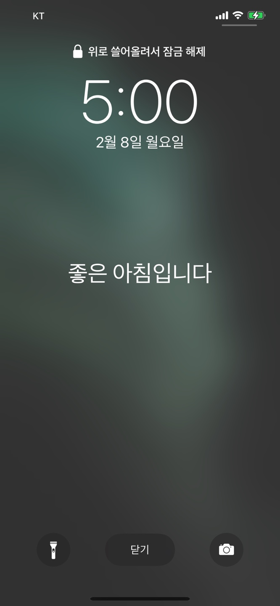
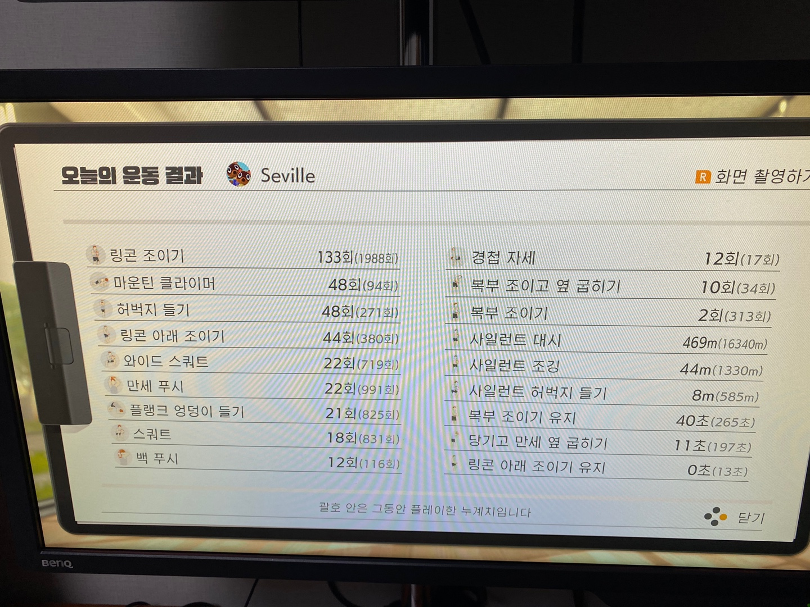

매일 실천한 미라클 모닝에 대해 포스팅한다.

## 목표

- [x] 평일 기준 매일 5시 ~ 5시 30분 사이 기상
- [x] 운동(링피트 - 매일 1개의 챕터 클리어) 30분
- [x] 출근전 공부(프로그래밍) 30분 ~ 1시간

## **기상**

아침 기상 알람은 5시로 맞췄지만
더 자버려서 5시 30분에 기상했다.

매일 5시 기상이 안되면 5시 30분 기상으로 바꿔야할듯

* * *

## **운동**

링피트는 원래 스토리를 진행해야 하는데 포션이 없어

파밍 겸 밀린 퀘스트들을 클리어 하면서 오늘 할당량을 채웠다.

